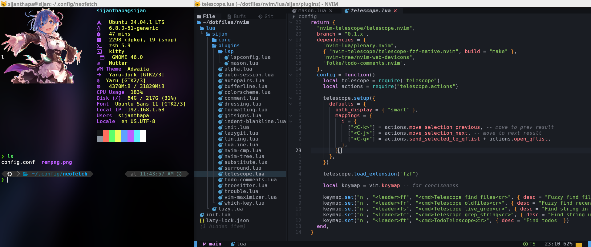

    

# 👻 Don't blindly use my setup. Use at your own risk!!!

<b> Make sure Zsh is set as your default shell. I use the Powerlevel10k theme, which you can clone from the official GitHub repository. Additionally, clone the Zsh Autosuggestions and Syntax Highlighting plugins from their respective GitHub repositories. 
